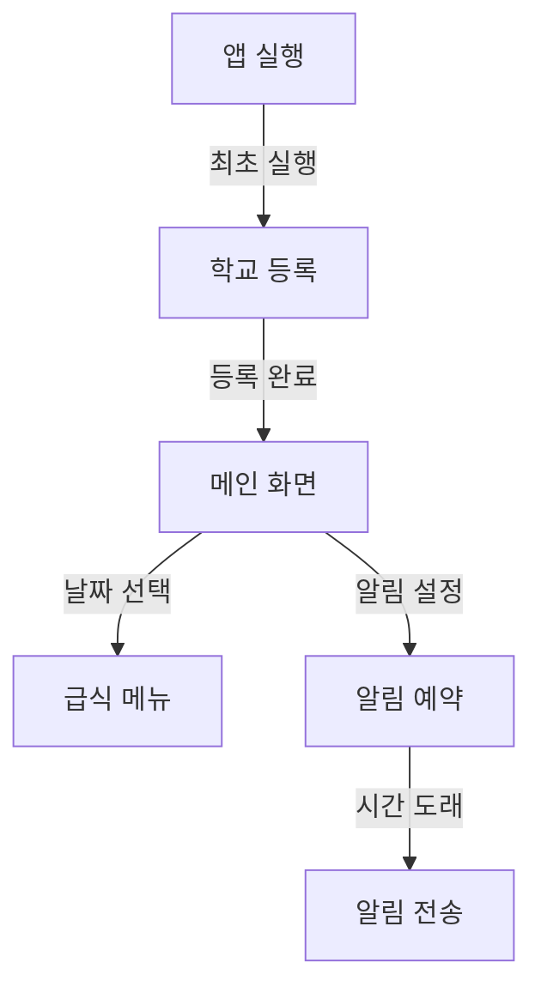
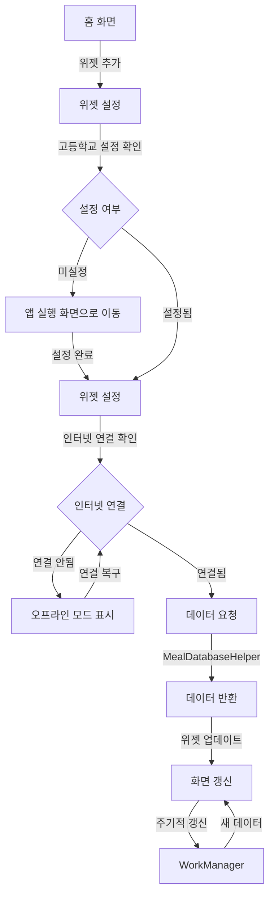

# 🍱 KTECH 급식 알리미 Android 앱

<div align="center">
  
  
  
  
</div>

## 📋 프로젝트 소개

**KTECH 급식 알리미**는 고등학교 학생들을 위한 급식 정보 제공 및 알림 앱입니다.  
사용자는 자신의 학교를 등록하면, 매일 아침과 점심에 오늘의 급식 메뉴를 알림으로 받아볼 수 있습니다.  
또한, 앱 내에서 날짜별 급식 메뉴를 확인할 수 있으며, 공휴일과 주말은 자동으로 제외됩니다.

## 📖 사용 방법
1. 앱을 실행하고 학교 이름을 입력하여 등록합니다.
2. 메인 화면에서 날짜를 선택하여 급식 메뉴를 확인합니다.
3. 알림 설정을 통해 매일 급식 메뉴를 받아볼 수 있습니다.
4. 홈 화면 위젯을 통해 빠르게 급식 정보를 확인할 수 있습니다.

## ⚙️ 주요 기능

### 🏫 학교 등록 및 로그인
- 사용자는 최초 실행 시 자신의 고등학교 이름을 입력하여 등록합니다.
- 등록된 학교 정보는 SharedPreferences에 저장됩니다.

### 📅 급식 메뉴 조회
- 날짜별로 급식 메뉴를 확인할 수 있습니다.
- 급식 데이터는 `assets/menu.json`에 저장되어 있으며, 앱 설치 시 SQLite DB로 변환됩니다.

### 🔔 급식 알림
- 매일 오전 7시, 오후 12시에 오늘의 급식 메뉴가 알림(Notification)으로 전송됩니다.
- (Android 13 이상은 알림 권한 필요)

### 📅 공휴일/주말 자동 제외
- 공휴일 및 주말에는 급식 알림이 전송되지 않으며, 메뉴도 표시되지 않습니다.

### 📱 위젯 지원
- 급식 정보를 홈 화면 위젯으로도 확인할 수 있습니다.

## 🔄 앱 흐름도

### 📱 메인 앱 흐름


### 📱 위젯 흐름


## 🏗️ 시스템 아키텍처

### 🔄 아키텍처 패턴
- MVVM (Model-View-ViewModel) 패턴 적용
- Repository 패턴을 통한 데이터 관리
- WorkManager를 활용한 백그라운드 작업 처리

### 🧩 주요 컴포넌트
1. **UI Layer**
   - MainActivity: 메인 화면
   - LoginActivity: 학교 등록
   - MealFragment: 급식 메뉴 표시
   - WidgetProvider: 홈 화면 위젯

2. **Data Layer**
   - MealDatabaseHelper: SQLite DB 관리
   - SharedPreferences: 설정 저장
   - menu.json: 급식 데이터

3. **Service Layer**
   - NotificationReceiver: 알림 처리
   - WorkManager: 백그라운드 작업

## 📈 성능 최적화

### 💾 데이터 최적화
- SQLite 인덱싱
- 메모리 캐싱
- 지연 로딩

### 🔔 알림 최적화
- WorkManager 활용
- 배터리 최적화 예외 처리
- 알림 채널 관리

## 🔐 보안

### 🔒 데이터 보안
- SharedPreferences 암호화
- 네트워크 통신 보안
- 권한 관리

## 🔧 설치 방법

1. 프로젝트를 클론합니다:
```bash
git clone https://github.com/JongHyun070105/KTECH.git
```

2. Android Studio에서 프로젝트를 엽니다.
3. 필요한 의존성을 설치합니다:
```bash
./gradlew build
```

4. 앱을 실행합니다.

## 📱 시스템 요구사항

- Android SDK 26 이상
- Kotlin 1.8.20 이상
- Android Studio Hedgehog 이상

## 📦 사용된 라이브러리

- AndroidX, Material Components
- Glide (이미지 로딩)
- OpenCSV (CSV 파싱)
- SQLite (내장 DB)

## 🔒 권한

- `INTERNET`
- `ACCESS_NETWORK_STATE`
- `POST_NOTIFICATIONS` (Android 13 이상)
- `SCHEDULE_EXACT_ALARM`

## 📄 라이센스

이 프로젝트는 MIT 라이센스를 따릅니다.
